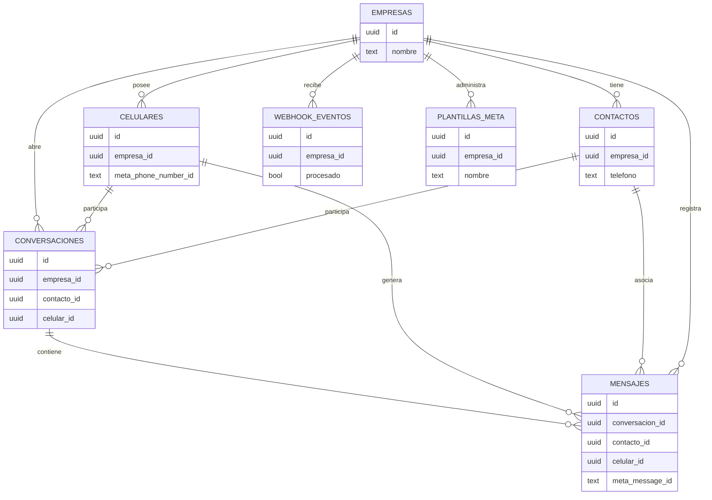

# Backend Spec - Meta WhatsApp API System

## 1. Objetivo
Implementar un backend multi-empresa en FastAPI que permita registrar celulares habilitados por Meta, exponer mensajes entrantes a los clientes y enviar mensajes salientes (texto, plantillas y media) utilizando la WhatsApp Cloud API. Todos los flujos deben cumplir con las politicas oficiales de Meta ([WhatsApp Cloud API Docs](https://developers.facebook.com/docs/whatsapp/cloud-api)) y registrar cada interaccion en base de datos para auditoria.

## 2. Alcance funcional
- Gestion de empresas: alta/baja/modificacion, llaves propias y limites de uso.
- Maestro de celulares: cada registro se enlaza a una empresa y a un `phone_number_id` provisto por Meta.
- Maestro de contactos: alias y metadata necesaria para la trazabilidad.
- Consola de mensajes: historico, estado y errores asociados.
- Webhook oficial: recepcion de notificaciones de mensajes, estados y errores.
- Servicio de envio: mensajeria template y text/media (segun permisos de Meta).
- Seguridad multi-tenant basada en `id_empresa` (header o JWT) y scoping a recursos propios.

## 3. Modelo de datos (PostgreSQL + SQLModel)

### 3.1 Entidades principales

| Tabla | Campos clave | Descripcion |
|-------|--------------|-------------|
| `empresas` | `id (UUID PK)`, `nombre`, `estado`, `webhook_secret`, `meta_app_id`, `meta_access_token`, `created_at`, `updated_at` | Representa a cada cliente. El token puede rotar y se cifra en reposo. |
| `celulares` | `id (UUID PK)`, `empresa_id (FK)`, `alias`, `phone_number`, `meta_phone_number_id`, `estado`, `estado_desde`, `ultimo_token_valido`, `limite_mensual`, `created_at` | Celulares que Meta habilito dentro del WABA. `estado` controla disponibilidad (activo, suspendido, mantenimiento). |
| `contactos` | `id (UUID PK)`, `empresa_id`, `nombre`, `telefono`, `pais`, `metadata`, `created_at`, `updated_at` | Contactos finales autorizados. `metadata` (JSONB) almacena etiquetas externas. |
| `conversaciones` | `id (UUID PK)`, `empresa_id`, `contacto_id`, `celular_id`, `canal` (whatsapp), `contexto_meta` (JSONB con conversation.id, expiration_timestamp), `estado`, `created_at`, `closed_at` | Agrupa mensajes segun la ventana activa definida por Meta. |
| `mensajes` | `id (UUID PK)`, `conversacion_id`, `empresa_id`, `celular_id`, `contacto_id`, `meta_message_id`, `direccion` (in/out), `tipo` (text, template, image, document, interactive), `contenido` (JSONB), `status` (queued, sent, delivered, read, failed), `error_code`, `meta_payload` (JSONB), `created_at`, `sent_at`, `delivered_at`, `read_at` | Registro auditado de todos los mensajes. |
| `webhook_eventos` | `id`, `empresa_id`, `raw_payload` (JSONB), `tipo_evento`, `meta_entry_id`, `procesado` (bool), `created_at`, `processed_at` | Permite reintentar procesamiento en caso de fallos. |
| `plantillas_meta` (opcional) | `id`, `empresa_id`, `nombre`, `categoria`, `idioma`, `estado_meta`, `ultima_revision`, `variables` (JSONB) | Sincroniza las plantillas habilitadas por empresa. |
| `logs_integracion` | `id`, `empresa_id`, `celular_id`, `scope` (send/webhook/sync), `request`, `response`, `status_code`, `intent`, `resultado`, `created_at` | Logging estructurado para troubleshooting. |

### 3.2 Relaciones y reglas
- `empresas` 1..N `celulares`, `contactos`, `conversaciones`.
- `conversaciones` 1..N `mensajes`; la combinacion `empresa_id + contacto_id` define la ventana activa vigente. Se crea una nueva conversacion cuando Meta cierra la conversation window (24h desde el ultimo mensaje del usuario) o cuando se envia un template.
- `mensajes.meta_message_id` es unico cuando `direccion = 'out'`.
- `webhook_eventos` conserva la data original para auditoria y permite reprocesar.
- Indices recomendados: `mensajes (empresa_id, contacto_id, created_at)` y `webhook_eventos (procesado, created_at)`.

## 4. Integracion con WhatsApp Cloud API

### 4.1 Variables y configuracion
- `META_API_VERSION` (ej. `v20.0` acorde a documentacion official).
- `META_GRAPH_HOST=https://graph.facebook.com`
- `META_WEBHOOK_VERIFY_TOKEN` por empresa (o global si se usa un unico endpoint).
- Cada `celular` debe almacenar su `meta_phone_number_id` y el `WABA_ID` (opcional).
- Access token per empresa (permanent o via system user). Guardar cifrado y refrescar segun politicas.

### 4.2 Envio de mensajes (plantilla)
1. Validar que la empresa y el celular esten activos y con cuota disponible.
2. Tomar el access token vigente de la empresa, o rechazar si expiro.
3. Ensamblar payload siguiendo la documentacion oficial de Meta. Ejemplo basado en la prueba indicada:
   ```bash
   curl -i -X POST `
     https://graph.facebook.com/v22.0/{PHONE_NUMBER_ID}/messages `
     -H "Authorization: Bearer {ACCESS_TOKEN}" `
     -H "Content-Type: application/json" `
     -d '{ "messaging_product": "whatsapp", "to": "541156384310", "type": "template", "template": { "name": "hello_world", "language": { "code": "en_US" } } }'
   ```
4. Registrar intento en `logs_integracion` con request/response.
5. Persistir el mensaje con `status='queued'` y actualizar segun respuesta (`meta_message_id`, `conversation.id`).

### 4.3 Mensajes de texto o media
- `type` puede ser `text`, `image`, `document`, `audio` o `interactive`.
- Para texto, se debe cumplir la regla de las 24h (session messages). Validar `contexto_meta.expire_at`.
- Para media, subir previamente mediante Graph `/v{version}/{phone_number_id}/media`.

### 4.4 Webhook
- Endpoint publico `POST /api/v1/webhooks/meta/whatsapp`.
- Verificacion `GET` con `hub.mode`, `hub.challenge`, `hub.verify_token` (debe coincidir con `META_WEBHOOK_VERIFY_TOKEN`).
- Guardar cada notificacion en `webhook_eventos` y despachar async (ej. Celery, RQ o background tasks FastAPI) que:
  - Actualice estados `delivered`/`read`.
  - Cree mensajes `inbound` para cada `messages` entry (mapear `from`, `id`, `text.body`, etc).
  - Genere registros `contactos` si no existen.

## 5. Endpoints FastAPI (v1)

| Metodo y path | Descripcion | Request principal | Respuesta | Auth |
|---------------|-------------|-------------------|-----------|------|
| `POST /api/v1/auth/token` | Genera JWT scoped a `empresa` (optional si se usa API key) | `{ "client_id", "client_secret" }` | `{ "access_token", "expires_in" }` | Basic/Client Secret |
| `GET /api/v1/empresas` | Lista empresas (solo staff). | Query `estado`, `search`. | Lista paginada. | Admin |
| `POST /api/v1/empresas` | Alta de empresa. | Datos basicos y credenciales Meta. | Empresa creada. | Admin |
| `GET /api/v1/celulares` | Lista celulares visibles para la empresa. | Query `estado`. | Lista paginada. | JWT empresa |
| `POST /api/v1/celulares` | Alta/edicion de celular y phone number id. | `{ alias, phone_number, meta_phone_number_id, estado }`. | Celular. | Admin empresa |
| `GET /api/v1/contactos` | Listar contactos propios. | Query `search`. | Lista. | JWT empresa |
| `POST /api/v1/contactos` | Crear contacto. | Datos contacto + etiquetas. | Contacto. | JWT empresa |
| `GET /api/v1/mensajes` | Listar mensajes por contacto/conversacion. | Query `contacto_id`, `celular_id`, `estado`. | Lista paginada + metadata. | JWT empresa |
| `POST /api/v1/mensajes/send` | Enviar mensaje session/text. | `{ "celular_id", "contacto_id"|"to", "tipo", "contenido" }`. | `{ "mensaje_id", "meta_message_id", "status" }`. | JWT empresa |
| `POST /api/v1/mensajes/send-template` | Enviar template. | `{ "celular_id", "to", "template_name", "language", "components" }`. | idem. | JWT empresa |
| `POST /api/v1/mensajes/inbound-test` | Endpoint interno para simular eventos (solo QA). | Payload tipo webhook. | Evento almacenado. | Admin |
| `GET /api/v1/conversaciones` | Lista conversaciones activas. | Query `estado`, `contacto_id`. | Lista paginada. | JWT empresa |
| `GET /api/v1/webhooks/meta/whatsapp` | Verificacion Meta (publico). | Query oficial. | `hub.challenge`. | Public |
| `POST /api/v1/webhooks/meta/whatsapp` | Recepcion de eventos. | Payload Graph. | `200 OK`. | Public (validado con verify token) |
| `POST /api/v1/sync/plantillas` | Sincroniza plantillas desde Meta `/message_templates`. | `{ "celular_id" }`. | Listado actualizado. | Admin empresa |

### Reglas adicionales
- Todas las peticiones autenticadas deben incluir `X-Empresa-Id` o se deduce del JWT.
- Respuesta paginada standar: `{ "items": [], "meta": { "page", "size", "total" } }`.
- Validar limites diarios/mensuales por empresa y celular antes de enviar.
- Manejar reintentos con exponential backoff al llamar a Meta (429/5xx).

## 6. Casos de prueba

### 6.1 Modelo y validaciones
1. **Crear empresa exitosa**: persiste datos obligatorios, genera `webhook_secret`. Esperado: PK generada, timestamps.
2. **Celular duplicado por numero**: insertar phone ya existente dentro de la misma empresa debe fallar con `409`.
3. **Contacto auto-creado via webhook**: al procesar evento inbound de numero desconocido, se genera contacto con estado `nuevo`.

### 6.2 API de gestion
4. **Listar celulares filtrados**: `GET /celulares?estado=activo` debe filtrar por empresa del token.
5. **Crear contacto sin nombre**: request con solo `telefono` debe pasar si `telefono` esta en formato E.164.
6. **Intento de enviar mensaje con celular ajeno**: `celular_id` de otra empresa => `403`.

### 6.3 Envio de mensajes
7. **Enviar template valido**: mockear Meta y validar que se llama a `/{phone_number_id}/messages` con `messaging_product=whatsapp`. Guardar `meta_message_id`.
8. **Error token expirado**: Meta responde `401 Unsupported get request`. Backend debe refrescar token (si hay refresh) o marcar mensaje como `failed` con `error_code`.
9. **Limite de cuota excedido**: si `limite_mensual` alcanzado, endpoint devuelve `422` y no llama a Meta.

### 6.4 Webhook
10. **Verificacion GET**: `hub.verify_token` incorrecto => `403`.
11. **Recepcion message inbound**: al recibir payload `messages` tipo `text`, se crea `mensaje` inbound y se actualiza/conecta `conversacion`.
12. **Recepcion status**: payload `statuses` actualiza `mensajes.status` a `delivered/read` segun `status`.

### 6.5 Seguridad y auditoria
13. **Acceso sin header empresa**: request autenticada sin `X-Empresa-Id` -> `400`.
14. **JWT expirado**: `401`.
15. **Logs de integracion**: ante respuesta 5xx de Meta, se crea registro con `resultado=error` para soporte.

### 6.6 Integracion externa
16. **Sync plantillas**: mock `GET /{WABA_ID}/message_templates` y validar insercion/actualizacion.
17. **Webhook reintento**: marcar `webhook_evento` como no procesado para probar reenvio.

## 7. Consideraciones tecnicas
- Utilizar SQLModel y Alembic para migrations. Campos JSONB requieren `sqlalchemy.dialects.postgresql.JSONB`.
- Servicios asincronicos: `httpx.AsyncClient` para llamadas a Meta con timeouts y retries.
- Background tasks: FastAPI BackgroundTasks o Celery para procesar webhooks y heavy jobs.
- Configuracion per entorno: separar tokens dev/prod y restringir webhook dev con ngrok.
- Observabilidad: estructurar logs y exponer metricas (Prometheus) para total de mensajes, errores, etc.

## 8. Referencias oficiales
- [Enviar mensajes con plantillas](https://developers.facebook.com/docs/whatsapp/cloud-api/reference/messages#send_message)
- [Eventos de webhook](https://developers.facebook.com/docs/whatsapp/cloud-api/webhooks/payload-examples)
- [Sincronizacion de plantillas](https://developers.facebook.com/docs/whatsapp/business-management-api/message-templates)
- [Limites y ventanas de conversacion](https://developers.facebook.com/docs/whatsapp/conversation-types)

El backend debe mantenerse actualizado con la version mas reciente soportada (actualmente `v22.0` segun el curl proporcionado) y monitorear cambios deversion en la documentacion oficial.

## 9. Diagrama Entidad-Relacion


