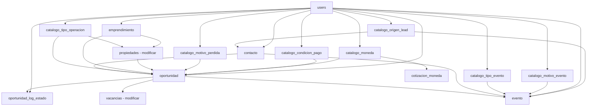

# Análisis de Impacto - Modelo de Datos CRM Oportunidades

> **Referencia:** [20251118_oportunidades_spec_modelo.md](./20251118_oportunidades_spec_modelo.md)  
> **Patrones:** [README_BACKEND_PATTERNS_v1.md](../README_BACKEND_PATTERNS_v1.md)  
> **Versión:** 1.0  
> **Fecha:** 2025-11-18  
> **Autor:** Sistema

---

## 1. RESUMEN EJECUTIVO

### 1.1 Alcance del cambio

| Métrica | Cantidad | Detalle |
|---------|----------|---------|
| **Tablas nuevas** | 14 | 8 catálogos + 5 entidades + 1 emprendimiento |
| **Tablas modificadas** | 2 | `propiedades` (3 cols), `vacancias` (1 col) |
| **Foreign Keys nuevas** | 25 | Ver detalle en sección 3 |
| **Índices nuevos** | 15+ | Performance para búsquedas y dashboards |
| **Archivos de modelo** | 14 | Nuevos archivos Python en `app/models/` |
| **Archivos de migración** | 16+ | Alembic migrations |
| **Scripts de seed** | 14 | Datos iniciales para todas las tablas |
| **Routers nuevos** | 14 | Endpoints CRUD para cada entidad |

### 1.2 Nivel de complejidad

- **Complejidad técnica:** MEDIA-ALTA
- **Riesgo de datos:** MEDIO (modificación de tablas existentes con datos)
- **Esfuerzo estimado:** 5-7 días de desarrollo
- **Testing requerido:** ALTO (lógica de negocio compleja)

---

## 2. IMPACTO EN TABLAS EXISTENTES

### 2.1 Tabla `propiedades` ⚠️ MODIFICACIÓN CRÍTICA

**Estado actual:**
- 5 registros de datos de prueba existentes (según `DEFAULT_PROPIEDADES`)
- Columnas actuales: 15 campos (id, nombre, tipo, propietario, estado, ambientes, metros_cuadrados, valor_alquiler, expensas, fecha_ingreso, vencimiento_contrato, estado_fecha, estado_comentario, created_at, updated_at, deleted_at, version)
- Relaciones actuales: `facturas`, `vacancias`

**Cambios requeridos:**

| Campo | Tipo | Acción | Impacto |
|-------|------|--------|---------|
| `tipo_operacion_id` | INT | AGREGAR | NULL permitido, migrar datos existentes a "alquiler" |
| `emprendimiento_id` | INT | AGREGAR | NULL permitido, sin datos iniciales |
| `costo_propiedad` | DECIMAL(15,2) | AGREGAR | NULL permitido, sin datos iniciales |

**Relaciones nuevas:**
- `tipo_operacion` → `CatalogoTipoOperacion` (Many-to-One)
- `emprendimiento` → `Emprendimiento` (Many-to-One, nullable)
- `oportunidades` → `Oportunidad` (One-to-Many, back_populates)

**Script de migración:**
```python
def upgrade():
    # 1. Agregar columnas con NULL
    op.add_column('propiedades', 
        sa.Column('tipo_operacion_id', sa.Integer(), nullable=True))
    op.add_column('propiedades', 
        sa.Column('emprendimiento_id', sa.Integer(), nullable=True))
    op.add_column('propiedades', 
        sa.Column('costo_propiedad', sa.DECIMAL(15, 2), nullable=True))
    
    # 2. Crear foreign keys
    op.create_foreign_key(
        'fk_propiedades_tipo_operacion', 
        'propiedades', 'catalogo_tipo_operacion',
        ['tipo_operacion_id'], ['id']
    )
    op.create_foreign_key(
        'fk_propiedades_emprendimiento', 
        'propiedades', 'emprendimientos',
        ['emprendimiento_id'], ['id']
    )
    
    # 3. Crear índices
    op.create_index('idx_propiedades_tipo_operacion', 'propiedades', ['tipo_operacion_id'])
    op.create_index('idx_propiedades_emprendimiento', 'propiedades', ['emprendimiento_id'])
    
    # 4. Migrar datos existentes: asignar "alquiler" por defecto
    op.execute("""
        UPDATE propiedades 
        SET tipo_operacion_id = (
            SELECT id FROM catalogo_tipo_operacion WHERE codigo = 'alquiler'
        )
        WHERE tipo_operacion_id IS NULL
    """)
    
    # 5. Agregar constraint CHECK
    op.create_check_constraint(
        'chk_propiedades_costo_positivo',
        'propiedades',
        'costo_propiedad IS NULL OR costo_propiedad >= 0'
    )

def downgrade():
    op.drop_constraint('chk_propiedades_costo_positivo', 'propiedades')
    op.drop_index('idx_propiedades_emprendimiento', 'propiedades')
    op.drop_index('idx_propiedades_tipo_operacion', 'propiedades')
    op.drop_constraint('fk_propiedades_emprendimiento', 'propiedades')
    op.drop_constraint('fk_propiedades_tipo_operacion', 'propiedades')
    op.drop_column('propiedades', 'costo_propiedad')
    op.drop_column('propiedades', 'emprendimiento_id')
    op.drop_column('propiedades', 'tipo_operacion_id')
```

**Cambios en el modelo Python:**
```python
# Archivo: backend/app/models/propiedad.py

# AGREGAR en imports
from typing import Optional, List, TYPE_CHECKING
from decimal import Decimal
from sqlalchemy import Column, DECIMAL

if TYPE_CHECKING:
    from .factura import Factura
    from .vacancia import Vacancia
    from .oportunidad import Oportunidad  # ← NUEVO
    from .catalogo_tipo_operacion import CatalogoTipoOperacion  # ← NUEVO
    from .emprendimiento import Emprendimiento  # ← NUEVO

# AGREGAR después de estado_comentario:

# CRM - Gestión comercial
tipo_operacion_id: Optional[int] = Field(
    default=None, 
    foreign_key="catalogo_tipo_operacion.id",
    description="Tipo de operación principal de la propiedad"
)
tipo_operacion: Optional["CatalogoTipoOperacion"] = Relationship(
    back_populates="propiedades"
)

emprendimiento_id: Optional[int] = Field(
    default=None,
    foreign_key="emprendimientos.id",
    description="Emprendimiento al que pertenece (si aplica)"
)
emprendimiento: Optional["Emprendimiento"] = Relationship(
    back_populates="propiedades"
)

costo_propiedad: Optional[Decimal] = Field(
    default=None,
    sa_column=Column(DECIMAL(15, 2)),
    description="Costo de adquisición o construcción para cálculo de rentabilidad"
)

# AGREGAR en relaciones existentes:
oportunidades: List["Oportunidad"] = Relationship(back_populates="propiedad")
```

**Riesgos y mitigación:**
- ⚠️ **Riesgo MEDIO:** Agregar FK puede fallar si hay inconsistencias en datos
- ✅ **Mitigación:** Validar integridad antes de migración, permitir NULL
- ⚠️ **Riesgo BAJO:** Cambio en modelo puede afectar código existente
- ✅ **Mitigación:** Los campos nuevos son opcionales, no rompen funcionalidad actual

---

### 2.2 Tabla `vacancias` ⚠️ MODIFICACIÓN MENOR

**Estado actual:**
- Relacionada con `propiedades` (FK existente)
- Registra ciclos de vacancia de propiedades
- Campos de fechas por estado (recibida, en_reparacion, disponible, alquilada, retirada)

**Cambios requeridos:**

| Campo | Tipo | Acción | Impacto |
|-------|------|--------|---------|
| `oportunidad_id` | INT | AGREGAR | NULL permitido, indica qué oportunidad cerró el ciclo |

**Relación nueva:**
- `oportunidad` → `Oportunidad` (Many-to-One, nullable)

**Script de migración:**
```python
def upgrade():
    # 1. Agregar columna con NULL
    op.add_column('vacancias', 
        sa.Column('oportunidad_id', sa.Integer(), nullable=True))
    
    # 2. Crear foreign key
    op.create_foreign_key(
        'fk_vacancias_oportunidad', 
        'vacancias', 'oportunidades',
        ['oportunidad_id'], ['id']
    )
    
    # 3. Crear índice
    op.create_index('idx_vacancias_oportunidad', 'vacancias', ['oportunidad_id'])

def downgrade():
    op.drop_index('idx_vacancias_oportunidad', 'vacancias')
    op.drop_constraint('fk_vacancias_oportunidad', 'vacancias')
    op.drop_column('vacancias', 'oportunidad_id')
```

**Cambios en el modelo Python:**
```python
# Archivo: backend/app/models/vacancia.py

# AGREGAR en imports
if TYPE_CHECKING:
    from .propiedad import Propiedad
    from .oportunidad import Oportunidad  # ← NUEVO

# AGREGAR después de comentario_retirada:

# Relación con oportunidad que cerró el ciclo
oportunidad_id: Optional[int] = Field(
    default=None,
    foreign_key="oportunidades.id",
    description="Oportunidad que cerró este ciclo de vacancia (ganó alquiler/venta)"
)
oportunidad: Optional["Oportunidad"] = Relationship(back_populates="vacancias")
```

**Riesgos y mitigación:**
- ⚠️ **Riesgo BAJO:** Campo nullable, no afecta datos existentes
- ✅ **Mitigación:** No requiere migración de datos, solo estructura

---

### 2.3 Tabla `users` - SIN MODIFICACIONES ESTRUCTURALES

**Impacto indirecto:**
- Se agregará relación `One-to-Many` con múltiples tablas nuevas:
  - `contactos.responsable_id` → `users.id`
  - `oportunidades.responsable_id` → `users.id`
  - `oportunidad_log_estado.usuario_id` → `users.id`
  - `eventos.asignado_a_id` → `users.id`
  - `emprendimientos.responsable_id` → `users.id`

**Cambios en el modelo Python:**
```python
# Archivo: backend/app/models/user.py

# AGREGAR en imports TYPE_CHECKING
if TYPE_CHECKING:
    from .item import Item
    from .pais import Paises
    from .tarea import Tarea
    from .solicitud import Solicitud
    from .contacto import Contacto  # ← NUEVO
    from .oportunidad import Oportunidad  # ← NUEVO
    from .oportunidad_log_estado import OportunidadLogEstado  # ← NUEVO
    from .evento import Evento  # ← NUEVO
    from .emprendimiento import Emprendimiento  # ← NUEVO

# AGREGAR al final de la clase, después de relaciones existentes:

# CRM - Relaciones
contactos_responsable: List["Contacto"] = Relationship(
    back_populates="responsable",
    sa_relationship_kwargs={"foreign_keys": "Contacto.responsable_id"}
)
oportunidades_responsable: List["Oportunidad"] = Relationship(
    back_populates="responsable",
    sa_relationship_kwargs={"foreign_keys": "Oportunidad.responsable_id"}
)
logs_oportunidad: List["OportunidadLogEstado"] = Relationship(
    back_populates="usuario"
)
eventos_asignados: List["Evento"] = Relationship(
    back_populates="asignado_a",
    sa_relationship_kwargs={"foreign_keys": "Evento.asignado_a_id"}
)
emprendimientos_responsable: List["Emprendimiento"] = Relationship(
    back_populates="responsable"
)
```

**Riesgos:**
- ✅ **Riesgo NULO:** Solo se agregan relaciones, sin cambios en estructura

---

## 3. NUEVAS TABLAS Y DEPENDENCIAS

### 3.1 Orden de creación (Dependency Graph)



**Orden correcto de creación:**
1. **Catálogos base** (pueden crearse en paralelo):
   - `catalogo_tipo_operacion`
   - `catalogo_motivo_perdida`
   - `catalogo_condicion_pago`
   - `catalogo_tipo_evento`
   - `catalogo_motivo_evento`
   - `catalogo_origen_lead`
   - `catalogo_moneda`

2. **Cotizaciones** (depende de moneda):
   - `cotizacion_moneda`

3. **Emprendimientos** (depende de users):
   - `emprendimiento`

4. **Modificar propiedades** (depende de tipo_operacion, emprendimiento):
   - ALTER TABLE `propiedades`

5. **Contactos** (depende de origen_lead, users):
   - `contacto`

6. **Oportunidades** (depende de contacto, tipo_operacion, emprendimiento, propiedades, motivo_perdida, moneda, condicion_pago, users):
   - `oportunidad`

7. **Logs y eventos** (dependen de oportunidad):
   - `oportunidad_log_estado`
   - `evento`

8. **Modificar vacancias** (depende de oportunidad):
   - ALTER TABLE `vacancias`

---

### 3.2 Matriz de dependencias (Foreign Keys)

| Tabla Origen | Campo FK | Tabla Destino | Nullable | Índice |
|--------------|----------|---------------|----------|--------|
| **cotizacion_moneda** | moneda_origen_id | catalogo_moneda | NO | ✓ |
| **cotizacion_moneda** | moneda_destino_id | catalogo_moneda | NO | ✓ |
| **emprendimiento** | responsable_id | users | NO | ✓ |
| **propiedades** | tipo_operacion_id | catalogo_tipo_operacion | SÍ | ✓ |
| **propiedades** | emprendimiento_id | emprendimientos | SÍ | ✓ |
| **contacto** | origen_lead_id | catalogo_origen_lead | SÍ | ✓ |
| **contacto** | responsable_id | users | NO | ✓ |
| **oportunidad** | contacto_id | contactos | NO | ✓ |
| **oportunidad** | tipo_operacion_id | catalogo_tipo_operacion | NO | ✓ |
| **oportunidad** | emprendimiento_id | emprendimientos | SÍ | ✓ |
| **oportunidad** | propiedad_id | propiedades | NO | ✓ |
| **oportunidad** | motivo_perdida_id | catalogo_motivo_perdida | SÍ | - |
| **oportunidad** | moneda_id | catalogo_moneda | SÍ | - |
| **oportunidad** | condicion_pago_id | catalogo_condicion_pago | SÍ | - |
| **oportunidad** | responsable_id | users | NO | ✓ |
| **oportunidad_log_estado** | oportunidad_id | oportunidades | NO | ✓ |
| **oportunidad_log_estado** | usuario_id | users | NO | - |
| **evento** | contacto_id | contactos | NO | ✓ |
| **evento** | tipo_id | catalogo_tipo_evento | NO | - |
| **evento** | motivo_id | catalogo_motivo_evento | NO | - |
| **evento** | asignado_a_id | users | NO | ✓ |
| **evento** | oportunidad_id | oportunidades | SÍ | ✓ |
| **evento** | origen_lead_id | catalogo_origen_lead | SÍ | - |
| **vacancias** | oportunidad_id | oportunidades | SÍ | ✓ |

**Total: 25 Foreign Keys nuevas**

---

## 4. IMPACTO EN ARCHIVOS DEL PROYECTO

### 4.1 Archivos nuevos a crear

**Modelos (`backend/app/models/`):**
```
catalogo_tipo_operacion.py
catalogo_motivo_perdida.py
catalogo_condicion_pago.py
catalogo_tipo_evento.py
catalogo_motivo_evento.py
catalogo_origen_lead.py
catalogo_moneda.py
cotizacion_moneda.py
emprendimiento.py
contacto.py
oportunidad.py
oportunidad_log_estado.py
evento.py
estado_oportunidad.py (enum)
estado_evento.py (enum)
```
**Total: 15 archivos**

**Routers (`backend/app/routers/`):**
```
catalogo_tipo_operacion_router.py
catalogo_motivo_perdida_router.py
catalogo_condicion_pago_router.py
catalogo_tipo_evento_router.py
catalogo_motivo_evento_router.py
catalogo_origen_lead_router.py
catalogo_moneda_router.py
cotizacion_moneda_router.py
emprendimiento_router.py
contacto_router.py
oportunidad_router.py
evento_router.py
```
**Total: 12 archivos** (algunos pueden compartir router)

**CRUD (`backend/app/crud/` - si se requiere lógica custom):**
```
oportunidad_crud.py (lógica de transición de estados)
contacto_crud.py (lógica de deduplicación)
evento_crud.py (lógica de creación automática de oportunidad)
```
**Total: 3 archivos** (opcional, solo si no se usa GenericCRUD)

**Servicios (`backend/app/services/`):**
```
oportunidad_service.py (lógica de negocio compleja)
dashboard_comercial_service.py (cálculos de métricas)
```
**Total: 2 archivos**

**Migraciones (`backend/alembic/versions/`):**
```
001_create_catalogos_crm.py (8 catálogos)
002_create_cotizacion_moneda.py
003_create_emprendimiento.py
004_alter_propiedades_add_crm_fields.py
005_create_contacto.py
006_create_oportunidad.py
007_create_oportunidad_log_estado.py
008_create_evento.py
009_alter_vacancias_add_oportunidad.py
010_add_indexes_crm.py
011_add_constraints_crm.py
```
**Total: 11 archivos de migración** (mínimo, pueden ser más si se separan)

**Scripts de seed (`backend/scripts/`):**
```
seed_catalogo_tipo_operacion.py
seed_catalogo_motivo_perdida.py
seed_catalogo_condicion_pago.py
seed_catalogo_tipo_evento.py
seed_catalogo_motivo_evento.py
seed_catalogo_origen_lead.py
seed_catalogo_moneda.py
seed_cotizacion_moneda.py
seed_emprendimiento.py
seed_contacto.py
seed_oportunidad.py
seed_evento.py
```
**Total: 12 archivos**

**Tests (`backend/tests/`):**
```
test_catalogo_tipo_operacion.py
test_oportunidad.py
test_oportunidad_transitions.py (validación de estados)
test_contacto.py
test_contacto_deduplication.py
test_evento.py
test_cotizacion_moneda.py
test_emprendimiento.py
```
**Total: 8+ archivos de test**

### 4.2 Archivos a modificar

**Modelos existentes:**
```
backend/app/models/propiedad.py (agregar 3 campos + relaciones)
backend/app/models/vacancia.py (agregar 1 campo + relación)
backend/app/models/user.py (agregar relaciones CRM)
backend/app/models/__init__.py (importar nuevos modelos)
```

**Configuración:**
```
backend/app/main.py (registrar nuevos routers)
backend/app/db.py (si se requiere lógica especial de inicialización)
```

**Documentación:**
```
backend/docs/README.md (agregar sección CRM)
backend/README.md (actualizar features)
```

---

## 5. IMPACTO EN DATOS EXISTENTES

### 5.1 Migración de datos en `propiedades`

**Datos actuales (5 registros):**
```python
DEFAULT_PROPIEDADES = (
    (1, 'Casa Central', 'Departamento', 'Inversiones SA', '1-recibida', ...),
    (2, 'Depósito Norte', 'Galpón', 'Logística SRL', '1-recibida', ...),
    (3, 'Oficina Microcentro', 'Oficina', 'Inmobiliaria SA', '1-recibida', ...),
    (4, 'Local Comercial 45', 'Local', 'Retail Partners', '1-recibida', ...),
    (5, 'Terreno Ruta 9', 'Terreno', 'Desarrollos SRL', '1-recibida', ...),
)
```

**Acción requerida:**
1. Todas las propiedades existentes se asignarán a `tipo_operacion = "alquiler"` por defecto
2. `emprendimiento_id` quedará en NULL (no pertenecen a emprendimiento)
3. `costo_propiedad` quedará en NULL (no se tiene dato histórico)

**Script de migración de datos:**
```sql
-- Asignar todas las propiedades existentes a "alquiler"
UPDATE propiedades 
SET tipo_operacion_id = (
    SELECT id FROM catalogo_tipo_operacion WHERE codigo = 'alquiler'
)
WHERE tipo_operacion_id IS NULL;
```

### 5.2 Datos en `vacancias`

**Acción requerida:**
- El campo `oportunidad_id` quedará en NULL para todos los registros existentes
- Los ciclos históricos no tendrán oportunidad asociada (es correcto)
- Solo los nuevos ciclos cerrados desde oportunidades tendrán el vínculo

**No requiere migración de datos**, solo estructura.

---

## 6. IMPACTO EN PERFORMANCE

### 6.1 Queries más complejos

**Queries actuales afectados:**

1. **Listado de propiedades:**
   - ANTES: `SELECT * FROM propiedades WHERE deleted_at IS NULL`
   - DESPUÉS: Potencial JOIN con `tipo_operacion` si se expande
   - **Impacto:** BAJO (los nuevos campos son opcionales)

2. **Listado de vacancias:**
   - ANTES: `SELECT * FROM vacancias JOIN propiedades`
   - DESPUÉS: Potencial JOIN adicional con `oportunidades`
   - **Impacto:** BAJO (campo nullable, JOIN opcional)

**Nuevos queries intensivos:**

1. **Dashboard comercial:**
   - Agregaciones por tipo_operacion, estado, fecha
   - Multiple JOINs: oportunidades → contacto, propiedad, usuario
   - **Solución:** Índices compuestos + caché de resultados

2. **Timeline de contacto:**
   - Unión de eventos + logs de oportunidades
   - Ordenamiento por fecha
   - **Solución:** Índices en fecha_evento, fecha_cambio

3. **Búsqueda de contactos (deduplicación):**
   - Búsqueda por email o teléfonos (JSON array)
   - **Solución:** Índice en email + GIN en telefonos (PostgreSQL)

### 6.2 Índices recomendados para performance

**Críticos (crear en migración inicial):**
```sql
-- Búsquedas de contactos
CREATE INDEX idx_contacto_email ON contactos(email) 
    WHERE email IS NOT NULL AND deleted_at IS NULL;
CREATE INDEX idx_contacto_telefonos ON contactos USING GIN (telefonos);

-- Dashboard comercial
CREATE INDEX idx_oportunidad_tipo_estado ON oportunidades(tipo_operacion_id, estado, created_at);
CREATE INDEX idx_oportunidad_estado_fecha ON oportunidades(estado, fecha_estado);
CREATE INDEX idx_oportunidad_responsable ON oportunidades(responsable_id, estado);

-- Timeline
CREATE INDEX idx_evento_contacto_fecha ON eventos(contacto_id, fecha_evento);
CREATE INDEX idx_evento_oportunidad_fecha ON eventos(oportunidad_id, fecha_evento) 
    WHERE oportunidad_id IS NOT NULL;
CREATE INDEX idx_log_oportunidad_fecha ON oportunidad_log_estado(oportunidad_id, fecha_cambio);

-- Cotizaciones
CREATE INDEX idx_cotizacion_lookup ON cotizacion_moneda(
    moneda_origen_id, moneda_destino_id, fecha_vigencia
);
```

**Impacto en escritura:**
- Cada índice adicional ralentiza INSERTs/UPDATEs en ~5-10%
- **15 índices nuevos** → impacto del 15-20% en escrituras de tablas indexadas
- **Mitigación:** Las tablas CRM tendrán volumen bajo/medio, impacto aceptable

---

## 7. IMPACTO EN INTEGRIDAD REFERENCIAL

### 7.1 Cascadas y restricciones

**Políticas de CASCADE recomendadas:**

| Relación | ON DELETE | ON UPDATE | Justificación |
|----------|-----------|-----------|---------------|
| contacto → oportunidad | RESTRICT | CASCADE | No borrar contacto si tiene oportunidades |
| oportunidad → log_estado | CASCADE | CASCADE | Borrar logs si se borra oportunidad |
| oportunidad → evento | SET NULL | CASCADE | Desvincular eventos si se borra oportunidad |
| propiedad → oportunidad | RESTRICT | CASCADE | No borrar propiedad si tiene oportunidades |
| user → oportunidad (responsable) | RESTRICT | CASCADE | No borrar usuario si es responsable |
| emprendimiento → propiedad | SET NULL | CASCADE | Desvincular propiedades si se borra emprendimiento |

**Soft delete:**
- Todas las tablas heredan de `Base` → tienen `deleted_at`
- Los borrados son lógicos, no físicos
- Las FKs deben ignorar registros con `deleted_at IS NOT NULL`

### 7.2 Validaciones cross-table

**Reglas de negocio que requieren validación:**

1. **Transición de estados de oportunidad:**
   - Validar que la transición sea permitida según matriz de estados
   - Requerir `motivo_perdida_id` si estado → "6-perdida"
   - Requerir `monto`, `moneda_id`, `condicion_pago_id` si estado → "5-ganada" o "4-reserva"

2. **Sincronía oportunidad ↔ propiedad:**
   - Si oportunidad estado = "5-ganada" y tipo = "alquiler":
     - Actualizar `propiedad.estado` = "4-alquilada"
     - Cerrar ciclo activo en `vacancias`
   - Si hay múltiples oportunidades sobre misma propiedad:
     - Solo la primera en ganar cierra el ciclo
     - Las restantes se fuerzan a "6-perdida" con motivo "ya_vendida"

3. **Deduplicación de contactos:**
   - Al crear contacto, buscar existente por email o teléfono
   - Si existe, reutilizar (no crear duplicado)

4. **Moneda default única:**
   - Solo puede haber una moneda con `es_default = True`
   - Validar con UNIQUE INDEX parcial

---

## 8. RIESGOS Y ESTRATEGIAS DE MITIGACIÓN

### 8.1 Matriz de riesgos

| Riesgo | Probabilidad | Impacto | Severidad | Mitigación |
|--------|--------------|---------|-----------|------------|
| **Fallo en migración de FK en propiedades** | MEDIA | ALTO | 🔴 CRÍTICO | Validar integridad antes, permitir NULL, rollback preparado |
| **Datos inconsistentes en tablas existentes** | BAJA | ALTO | 🟠 ALTO | Backup completo antes de migrar, script de validación |
| **Performance degradada en queries complejos** | MEDIA | MEDIO | 🟡 MEDIO | Índices apropiados, monitoreo de queries lentas |
| **Lógica de negocio incorrecta en transiciones** | MEDIA | ALTO | 🔴 CRÍTICO | Tests exhaustivos, validaciones en múltiples capas |
| **Deadlocks en actualizaciones concurrentes** | BAJA | MEDIO | 🟡 MEDIO | Transacciones cortas, retry logic, índices |
| **Seed data incompleto o incorrecto** | BAJA | BAJO | 🟢 BAJO | Validación post-seed, datos mínimos funcionales |
| **Frontend no sincronizado con cambios** | ALTA | MEDIO | 🟠 ALTO | Versionado de API, documentación OpenAPI |

### 8.2 Plan de rollback

**Nivel 1 - Rollback de migración (si falla):**
```bash
# Volver a versión anterior
alembic downgrade -1

# O volver a versión específica pre-CRM
alembic downgrade <revision_id>
```

**Nivel 2 - Restauración de backup (si datos corruptos):**
```bash
# Restaurar desde backup
pg_restore -d nombre_db backup_pre_crm.sql
```

**Nivel 3 - Desactivar módulo (si lógica falla):**
```python
# En main.py, comentar routers CRM
# app.include_router(oportunidad_router)  # ← Desactivar
```

---

## 9. ESTRATEGIA DE TESTING

### 9.1 Tests de migración

**Pre-migración:**
```python
def test_pre_migration_data_integrity():
    """Validar que datos existentes estén íntegros antes de migrar"""
    # Contar propiedades
    # Contar vacancias
    # Verificar que no haya FKs rotas
```

**Post-migración:**
```python
def test_post_migration_structure():
    """Validar que estructura nueva esté correcta"""
    # Verificar que columnas nuevas existan
    # Verificar que FKs estén creadas
    # Verificar que índices existan

def test_post_migration_data():
    """Validar que datos se migraron correctamente"""
    # Verificar que propiedades tengan tipo_operacion_id
    # Verificar que conteos coincidan
```

### 9.2 Tests de lógica de negocio

**Críticos:**
```python
# Transiciones de estado
test_oportunidad_transicion_valida()
test_oportunidad_transicion_invalida()
test_oportunidad_requiere_motivo_perdida()
test_oportunidad_requiere_monto_al_ganar()

# Deduplicación
test_contacto_deduplicacion_por_email()
test_contacto_deduplicacion_por_telefono()
test_contacto_no_duplicar_si_existe()

# Sincronía con propiedades
test_oportunidad_ganada_actualiza_propiedad()
test_oportunidad_ganada_cierra_vacancia()
test_multiples_oportunidades_solo_una_gana()

# Cotizaciones
test_cotizacion_moneda_conversion()
test_cotizacion_moneda_fecha_vigencia()
```

### 9.3 Tests de integración

```python
# Flujo completo
test_flujo_crear_evento_sin_contacto_ni_oportunidad()
test_flujo_evento_crea_contacto_y_oportunidad()
test_flujo_oportunidad_avanza_estados_hasta_ganada()
test_flujo_oportunidad_ganada_actualiza_propiedad_y_vacancia()

# Dashboard
test_dashboard_comercial_calcula_metricas()
test_dashboard_filtra_por_tipo_operacion()
test_dashboard_convierte_monedas()
```

---

## 10. CRONOGRAMA DE IMPLEMENTACIÓN SUGERIDO

### Fase 1: Estructura base (2 días)
- [ ] Crear modelos de catálogos (8 archivos)
- [ ] Crear migraciones de catálogos
- [ ] Crear scripts de seed de catálogos
- [ ] Tests de catálogos
- [ ] Validar que migraciones funcionan en dev

### Fase 2: Entidades principales (2 días)
- [ ] Crear modelo `emprendimiento`
- [ ] Modificar modelo `propiedad` (agregar campos CRM)
- [ ] Crear modelo `contacto` con lógica de deduplicación
- [ ] Crear modelo `oportunidad` con enum de estados
- [ ] Crear modelo `oportunidad_log_estado`
- [ ] Crear modelo `evento`
- [ ] Modificar modelo `vacancia` (agregar oportunidad_id)
- [ ] Modificar modelo `user` (agregar relaciones CRM)
- [ ] Migraciones de entidades principales
- [ ] Tests unitarios de modelos

### Fase 3: Lógica de negocio (1.5 días)
- [ ] Implementar CRUD custom para `oportunidad` (validaciones de transición)
- [ ] Implementar CRUD custom para `contacto` (deduplicación)
- [ ] Implementar CRUD custom para `evento` (auto-creación de oportunidad)
- [ ] Implementar servicio de sincronía oportunidad ↔ propiedad/vacancia
- [ ] Tests de lógica de negocio

### Fase 4: API y routers (1 día)
- [ ] Crear routers para catálogos
- [ ] Crear routers para entidades principales
- [ ] Crear endpoints custom (transición de estados, timeline, etc.)
- [ ] Registrar routers en `main.py`
- [ ] Tests de endpoints

### Fase 5: Dashboard y métricas (0.5 días)
- [ ] Implementar servicio de dashboard comercial
- [ ] Implementar endpoints de métricas y KPIs
- [ ] Tests de dashboard

### Fase 6: Validación y documentación (0.5 días)
- [ ] Ejecutar suite completa de tests
- [ ] Validar performance de queries clave
- [ ] Documentar endpoints en OpenAPI
- [ ] Actualizar README

**Total estimado: 7.5 días de desarrollo**

---

## 11. CHECKLIST PRE-DEPLOYMENT

### Validaciones previas a producción

- [ ] **Backup completo de BD de producción**
- [ ] **Validar integridad de datos existentes**
  ```sql
  SELECT COUNT(*) FROM propiedades WHERE deleted_at IS NULL;
  SELECT COUNT(*) FROM vacancias WHERE deleted_at IS NULL;
  ```
- [ ] **Probar migraciones en ambiente staging**
- [ ] **Verificar que rollback funciona**
- [ ] **Todos los tests pasan (unit + integration)**
- [ ] **Performance de queries clave validada (<1s)**
- [ ] **Seed data cargado correctamente en staging**
- [ ] **Documentación API actualizada**
- [ ] **Frontend sincronizado con cambios de backend**
- [ ] **Plan de rollback documentado y ensayado**

### Monitoreo post-deployment

- [ ] **Monitorear logs de errores en primeras 24h**
- [ ] **Verificar performance de queries CRM**
- [ ] **Validar que no hay FKs rotas**
- [ ] **Verificar conteos de registros**
  ```sql
  SELECT COUNT(*) FROM oportunidades;
  SELECT COUNT(*) FROM contactos;
  SELECT COUNT(*) FROM eventos;
  ```

---

## 12. CONCLUSIONES

### 12.1 Impacto general

- **Impacto estructural:** ALTO (14 tablas nuevas, 2 modificadas)
- **Impacto en datos:** MEDIO (modificación de tablas con datos existentes)
- **Impacto en código:** ALTO (60+ archivos nuevos/modificados)
- **Riesgo técnico:** MEDIO (bien mitigable con testing y rollback)
- **Complejidad de lógica:** ALTA (máquina de estados, sincronía, deduplicación)

### 12.2 Recomendaciones

1. ✅ **Implementar en fases:** No desplegar todo de una vez, validar cada fase
2. ✅ **Testing exhaustivo:** Especialmente lógica de transiciones y sincronía
3. ✅ **Backup obligatorio:** Antes de cualquier migración en producción
4. ✅ **Monitoreo activo:** Primeras 48h post-deployment
5. ✅ **Documentación completa:** Para facilitar mantenimiento futuro

### 12.3 Beneficios esperados

- 📊 **Trazabilidad completa** de oportunidades comerciales
- 🎯 **Dashboard comercial** con métricas en tiempo real
- 🔄 **Integración automática** con vacancias y propiedades
- 📈 **Mejor gestión** del pipeline comercial
- 💰 **Visibilidad de rentabilidad** por tipo de operación

---

**FIN - Análisis de Impacto del Modelo de Datos CRM Oportunidades**
