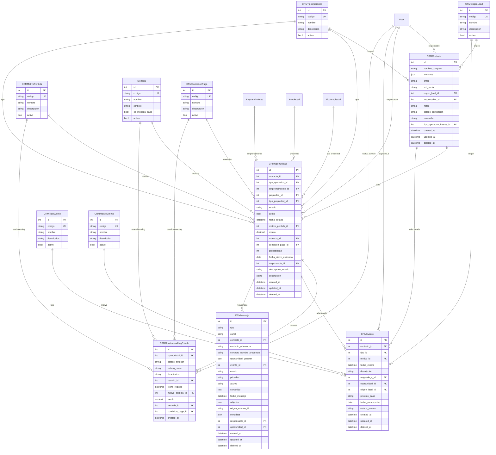

# Documentación del CRM - Entidades y Endpoints

**Fecha:** 29 de Noviembre, 2025  
**Sistema:** SAK (Sistemika) - Módulo CRM

---

## Tabla de Contenidos

1. [Entidades del CRM](#entidades-del-crm)
2. [Endpoints CRUD Genéricos](#endpoints-crud-genéricos)
3. [Endpoints Custom](#endpoints-custom)
4. [Diagrama de Relaciones](#diagrama-de-relaciones)

---

## Entidades del CRM

### 1. CRMContacto

**Tabla:** `crm_contactos`

Representa los contactos o leads del sistema CRM.

#### Campos:

| Campo | Tipo | Descripción | Obligatorio |
|-------|------|-------------|-------------|
| `id` | Integer | Identificador único | Sí (PK) |
| `nombre_completo` | String(255) | Nombre completo del contacto | Sí |
| `telefonos` | JSON Array | Lista de teléfonos normalizados | No |
| `email` | String(255) | Email del contacto | No |
| `red_social` | String(255) | Usuario/perfil en red social | No |
| `origen_lead_id` | Integer | FK a CRMOrigenLead | No |
| `responsable_id` | Integer | FK a User | Sí |
| `notas` | String(1000) | Notas adicionales | No |
| `estado_calificacion` | String(20) | Estado de calificación del lead | Sí (default: "nuevo") |
| `necesidad` | String(1000) | Descripción de la necesidad del contacto | No |
| `tipo_operacion_interes_id` | Integer | FK a CRMTipoOperacion | No |
| `created_at` | DateTime | Fecha de creación | Auto |
| `updated_at` | DateTime | Fecha de actualización | Auto |
| `deleted_at` | DateTime | Fecha de eliminación (soft delete) | No |

#### Relaciones:

- **origen_lead**: Relación many-to-one con `CRMOrigenLead`
- **tipo_operacion_interes**: Relación many-to-one con `CRMTipoOperacion`
- **responsable**: Relación many-to-one con `User`
- **oportunidades**: Relación one-to-many con `CRMOportunidad`
- **eventos**: Relación one-to-many con `CRMEvento`

#### Índices:

- `nombre_completo` (index)
- `email` (index)
- `estado_calificacion` (index)

#### Estados de Calificación:

- `nuevo`: Lead recién ingresado sin interacción
- `contactado`: Hubo primer intercambio/respuesta
- `en_seguimiento`: Hay interés, se mantiene conversación
- `agendado`: Tiene evento futuro programado
- `calificado`: Se creó al menos una oportunidad
- `descartado`: No es viable, sin interés real

---

### 2. CRMOportunidad

**Tabla:** `crm_oportunidades`

Representa las oportunidades de negocio en el pipeline de ventas.

#### Campos:

| Campo | Tipo | Descripción | Obligatorio |
|-------|------|-------------|-------------|
| `id` | Integer | Identificador único | Sí (PK) |
| `contacto_id` | Integer | FK a CRMContacto | Sí |
| `tipo_operacion_id` | Integer | FK a CRMTipoOperacion | No |
| `emprendimiento_id` | Integer | FK a Emprendimiento | No |
| `propiedad_id` | Integer | FK a Propiedad | No |
| `tipo_propiedad_id` | Integer | FK a TipoPropiedad | No |
| `estado` | String(20) | Estado del pipeline | Sí |
| `activo` | Boolean | Oportunidad activa | Sí (default: true) |
| `fecha_estado` | DateTime | Fecha del estado actual | Sí |
| `motivo_perdida_id` | Integer | FK a CRMMotivoPerdida | No |
| `monto` | Decimal(15,2) | Monto estimado | No |
| `moneda_id` | Integer | FK a Moneda | No |
| `condicion_pago_id` | Integer | FK a CRMCondicionPago | No |
| `probabilidad` | Integer | Probabilidad de cierre (0-100) | No |
| `fecha_cierre_estimada` | Date | Fecha estimada de cierre | No |
| `responsable_id` | Integer | FK a User | Sí |
| `descripcion_estado` | String(255) | Descripción del estado | No |
| `descripcion` | String(1000) | Descripción general | No |
| `created_at` | DateTime | Fecha de creación | Auto |
| `updated_at` | DateTime | Fecha de actualización | Auto |
| `deleted_at` | DateTime | Fecha de eliminación | No |

#### Estados posibles (Pipeline):

- `0-prospect`: Lead inicial sin calificar
- `1-abierta`: Oportunidad nueva
- `2-visita`: Visita programada/realizada
- `3-cotiza`: En proceso de cotización
- `4-reserva`: Reservada
- `5-ganada`: Oportunidad ganada/cerrada
- `6-perdida`: Oportunidad perdida

#### Relaciones:

- **contacto**: Relación many-to-one con `CRMContacto`
- **tipo_operacion**: Relación many-to-one con `CRMTipoOperacion`
- **emprendimiento**: Relación many-to-one con `Emprendimiento`
- **propiedad**: Relación many-to-one con `Propiedad`
- **tipo_propiedad**: Relación many-to-one con `TipoPropiedad`
- **motivo_perdida**: Relación many-to-one con `CRMMotivoPerdida`
- **moneda**: Relación many-to-one con `Moneda`
- **condicion_pago**: Relación many-to-one con `CRMCondicionPago`
- **responsable**: Relación many-to-one con `User`
- **logs_estado**: Relación one-to-many con `CRMOportunidadLogEstado`
- **eventos**: Relación one-to-many con `CRMEvento`
- **mensajes**: Relación one-to-many con `CRMMensaje`

#### Índices:

- `contacto_id` (index)
- `tipo_operacion_id` (index)
- `emprendimiento_id` (index)
- `propiedad_id` (index)
- `tipo_propiedad_id` (index)
- `estado` (index)
- Índice compuesto: `(estado, fecha_estado)`
- Índice compuesto: `(tipo_operacion_id, estado, created_at)`

---

### 3. CRMOportunidadLogEstado

**Tabla:** `crm_oportunidad_log_estado`

Registro de cambios de estado de las oportunidades (auditoría).

#### Campos:

| Campo | Tipo | Descripción | Obligatorio |
|-------|------|-------------|-------------|
| `id` | Integer | Identificador único | Sí (PK) |
| `oportunidad_id` | Integer | FK a CRMOportunidad | Sí |
| `estado_anterior` | String(20) | Estado previo | Sí |
| `estado_nuevo` | String(20) | Nuevo estado | Sí |
| `descripcion` | String(1000) | Descripción del cambio | No |
| `usuario_id` | Integer | FK a User (quien hizo el cambio) | Sí |
| `fecha_registro` | DateTime | Fecha del cambio | Sí |
| `motivo_perdida_id` | Integer | FK a CRMMotivoPerdida | No |
| `monto` | Decimal(15,2) | Monto al momento del cambio | No |
| `moneda_id` | Integer | FK a Moneda | No |
| `condicion_pago_id` | Integer | FK a CRMCondicionPago | No |
| `created_at` | DateTime | Fecha de creación | Auto |

#### Relaciones:

- **oportunidad**: Relación many-to-one con `CRMOportunidad`
- **motivo_perdida**: Relación many-to-one con `CRMMotivoPerdida`
- **moneda**: Relación many-to-one con `Moneda`
- **condicion_pago**: Relación many-to-one con `CRMCondicionPago`
- **usuario**: Relación many-to-one con `User`

---

### 4. CRMEvento

**Tabla:** `crm_eventos`

Representa actividades, llamadas, reuniones y tareas relacionadas con contactos y oportunidades.

#### Campos:

| Campo | Tipo | Descripción | Obligatorio |
|-------|------|-------------|-------------|
| `id` | Integer | Identificador único | Sí (PK) |
| `contacto_id` | Integer | FK a CRMContacto | Sí |
| `tipo_id` | Integer | FK a CRMTipoEvento | Sí |
| `motivo_id` | Integer | FK a CRMMotivoEvento | Sí |
| `fecha_evento` | DateTime | Fecha del evento | Sí |
| `descripcion` | String(2000) | Descripción del evento | Sí |
| `asignado_a_id` | Integer | FK a User | Sí |
| `oportunidad_id` | Integer | FK a CRMOportunidad | No |
| `origen_lead_id` | Integer | FK a CRMOrigenLead | No |
| `proximo_paso` | String(500) | Próximo paso a seguir | No |
| `fecha_compromiso` | Date | Fecha de compromiso/seguimiento | No |
| `estado_evento` | String(20) | Estado del evento | Sí |
| `created_at` | DateTime | Fecha de creación | Auto |
| `updated_at` | DateTime | Fecha de actualización | Auto |
| `deleted_at` | DateTime | Fecha de eliminación | No |

#### Estados del Evento:

- `pendiente`: Evento pendiente de realizar
- `hecho`: Evento completado

#### Relaciones:

- **contacto**: Relación many-to-one con `CRMContacto`
- **tipo**: Relación many-to-one con `CRMTipoEvento`
- **motivo**: Relación many-to-one con `CRMMotivoEvento`
- **asignado_a**: Relación many-to-one con `User`
- **oportunidad**: Relación many-to-one con `CRMOportunidad`
- **origen_lead**: Relación many-to-one con `CRMOrigenLead`

#### Índices:

- `contacto_id` (index)
- `oportunidad_id` (index)
- `fecha_evento` (index)
- `estado_evento` (index)

---

### 5. CRMMensaje

**Tabla:** `crm_mensajes`

Representa mensajes entrantes y salientes del CRM (WhatsApp, email, etc.).

#### Campos:

| Campo | Tipo | Descripción | Obligatorio |
|-------|------|-------------|-------------|
| `id` | Integer | Identificador único | Sí (PK) |
| `tipo` | String(20) | Tipo de mensaje (entrada/salida) | Sí |
| `canal` | String(30) | Canal del mensaje | Sí |
| `contacto_id` | Integer | FK a CRMContacto | No |
| `contacto_referencia` | String(255) | Tel/email/handle externo | No |
| `contacto_nombre_propuesto` | String(255) | Nombre sugerido por LLM cuando el mensaje no tiene contacto asociado. Se popula al llamar al endpoint `/llm-sugerir`. Es un campo transitorio que se usa hasta confirmar/rechazar la sugerencia. | No |
| `oportunidad_generar` | Boolean | Flag que indica si el LLM sugiere crear una oportunidad desde este mensaje. Se popula al llamar al endpoint `/llm-sugerir`. Se usa en el frontend para mostrar acciones sugeridas al usuario. Es un campo transitorio. | No |
| `evento_id` | Integer | FK a CRMEvento | No |
| `estado` | String(30) | Estado del mensaje | Sí |
| `prioridad` | String(20) | Prioridad del mensaje | Sí |
| `asunto` | String(255) | Asunto/título | No |
| `contenido` | Text | Contenido del mensaje | No |
| `fecha_mensaje` | DateTime | Fecha del mensaje | Sí |
| `adjuntos` | JSON Array | Lista de adjuntos | No |
| `origen_externo_id` | String(255) | ID del sistema externo | No |
| `metadata` | JSON | Metadata y sugerencias LLM | No |
| `responsable_id` | Integer | FK a User | No |
| `oportunidad_id` | Integer | FK a CRMOportunidad | No |
| `created_at` | DateTime | Fecha de creación | Auto |
| `updated_at` | DateTime | Fecha de actualización | Auto |
| `deleted_at` | DateTime | Fecha de eliminación | No |

#### Tipos de Mensaje:

- `entrada`: Mensaje recibido
- `salida`: Mensaje enviado

#### Canales:

- `whatsapp`: WhatsApp
- `email`: Correo electrónico
- `red_social`: Redes sociales
- `otro`: Otros canales

#### Estados:

- `nuevo`: Mensaje nuevo sin procesar
- `recibido`: Mensaje recibido y procesado
- `descartado`: Mensaje descartado
- `pendiente_envio`: Mensaje pendiente de envío
- `enviado`: Mensaje enviado exitosamente
- `error_envio`: Error al enviar mensaje

#### Prioridades:

- `alta`: Alta prioridad
- `media`: Prioridad media
- `baja`: Baja prioridad

#### Relaciones:

- **oportunidad**: Relación many-to-one con `CRMOportunidad`

#### Índices:

- `tipo` (index)
- `canal` (index)
- `contacto_id` (index)
- `contacto_referencia` (index)
- `estado` (index)
- `prioridad` (index)
- `fecha_mensaje` (index)
- `origen_externo_id` (index)
- `responsable_id` (index)
- `oportunidad_id` (index)

---

### 6. Entidades de Catálogo

Estas entidades representan catálogos y listas maestras del CRM.

#### 6.1. CRMTipoOperacion

**Tabla:** `crm_tipos_operacion`

Define los tipos de operaciones (Venta, Alquiler, etc.).

**Campos:**
- `id`, `codigo`, `nombre`, `descripcion`, `activo`
- Timestamps: `created_at`, `updated_at`, `deleted_at`

#### 6.2. CRMMotivoPerdida

**Tabla:** `crm_motivos_perdida`

Catálogo de motivos por los cuales se pierde una oportunidad.

**Campos:**
- `id`, `codigo`, `nombre`, `descripcion`, `activo`
- Timestamps: `created_at`, `updated_at`, `deleted_at`

#### 6.3. CRMCondicionPago

**Tabla:** `crm_condiciones_pago`

Condiciones de pago disponibles (Contado, Financiado, etc.).

**Campos:**
- `id`, `codigo`, `nombre`, `descripcion`, `activo`
- Timestamps: `created_at`, `updated_at`, `deleted_at`

#### 6.4. CRMTipoEvento

**Tabla:** `crm_tipos_evento`

Tipos de eventos (Llamada, Reunión, Email, etc.).

**Campos:**
- `id`, `codigo`, `nombre`, `descripcion`, `activo`
- Timestamps: `created_at`, `updated_at`, `deleted_at`

#### 6.5. CRMMotivoEvento

**Tabla:** `crm_motivos_evento`

Motivos de los eventos (Seguimiento, Consulta, Reclamo, etc.).

**Campos:**
- `id`, `codigo`, `nombre`, `descripcion`, `activo`
- Timestamps: `created_at`, `updated_at`, `deleted_at`

#### 6.6. CRMOrigenLead

**Tabla:** `crm_origenes_lead`

Origen de los leads (Web, Referido, Publicidad, etc.).

**Campos:**
- `id`, `codigo`, `nombre`, `descripcion`, `activo`
- Timestamps: `created_at`, `updated_at`, `deleted_at`

#### 6.7. Moneda

**Tabla:** `monedas`

Catálogo de monedas del sistema.

**Campos:**
- `id`, `codigo`, `nombre`, `simbolo`, `es_moneda_base`, `activo`
- Timestamps: `created_at`, `updated_at`, `deleted_at`

---

## Endpoints CRUD Genéricos

Todos los endpoints CRUD genéricos siguen el mismo patrón y están disponibles para cada entidad.

### Patrón Base

**Base URL:** `/api`

Cada entidad tiene su prefijo específico:

### Formato de Endpoints

#### 1. **Crear** (Create)
```
POST /api/{prefix}
Content-Type: application/json

Body: { ... campos del modelo ... }
```

**Respuesta:** `201 Created` con el objeto creado

---

#### 2. **Listar** (List)
```
GET /api/{prefix}?page={page}&perPage={perPage}&sortBy={field}&sortDir={asc|desc}
```

**Parámetros de consulta:**

| Parámetro | Tipo | Descripción |
|-----------|------|-------------|
| `page` | Integer | Número de página (default: 1) |
| `perPage` | Integer | Items por página (default: 25, max: 100) |
| `sortBy` | String | Campo para ordenar (default: created_at) |
| `sortDir` | String | Dirección: asc/desc (default: asc) |
| `q` | String | Búsqueda de texto en campos searchable |
| `filter` | JSON | Filtros adicionales (formato react-admin) |
| `sort` | JSON | Array [field, order] (react-admin) |
| `range` | JSON | Array [start, end] (react-admin) |
| `fields` | String | Campos a incluir (CSV) |
| `include` | String | Relaciones a incluir (CSV) |
| `deleted` | String | include/only/exclude (default: exclude) |

**Respuesta:** 
```json
{
  "data": [ ... array de objetos ... ],
  "total": 100,
  "page": 1,
  "perPage": 25
}
```

**Headers de respuesta:**
- `Content-Range`: items start-end/total
- `X-Total-Count`: total de items

---

#### 3. **Obtener uno** (Get One)
```
GET /api/{prefix}/{id}
```

**Respuesta:** `200 OK` con el objeto

---

#### 4. **Actualizar** (Update)
```
PUT /api/{prefix}/{id}
Content-Type: application/json

Body: { ... campos a actualizar ... }
```

**Respuesta:** `200 OK` con el objeto actualizado

---

#### 5. **Eliminar** (Delete - Soft Delete)
```
DELETE /api/{prefix}/{id}
```

**Respuesta:** `204 No Content`

---

### Endpoints CRUD por Entidad

#### Contactos
- **Prefix:** `/crm/contactos`
- **Tags:** `crm-contactos`

```
POST   /api/crm/contactos
GET    /api/crm/contactos
GET    /api/crm/contactos/{id}
PUT    /api/crm/contactos/{id}
DELETE /api/crm/contactos/{id}
```

---

#### Oportunidades
- **Prefix:** `/crm/oportunidades`
- **Tags:** `crm-oportunidades`

```
POST   /api/crm/oportunidades
GET    /api/crm/oportunidades
GET    /api/crm/oportunidades/{id}
PUT    /api/crm/oportunidades/{id}
DELETE /api/crm/oportunidades/{id}
```

---

#### Eventos
- **Prefix:** `/crm/eventos`
- **Tags:** `crm-eventos`

```
POST   /api/crm/eventos
GET    /api/crm/eventos
GET    /api/crm/eventos/{id}
PUT    /api/crm/eventos/{id}
DELETE /api/crm/eventos/{id}
```

---

#### Mensajes
- **Prefix:** `/crm/mensajes`
- **Tags:** `crm-mensajes`

```
POST   /api/crm/mensajes
GET    /api/crm/mensajes
GET    /api/crm/mensajes/{id}
PUT    /api/crm/mensajes/{id}
DELETE /api/crm/mensajes/{id}
```

---

#### Catálogos

Cada catálogo tiene endpoints CRUD idénticos:

```
# Tipos de Operación
/api/crm/catalogos/tipos-operacion

# Motivos de Pérdida
/api/crm/catalogos/motivos-perdida

# Condiciones de Pago
/api/crm/catalogos/condiciones-pago

# Tipos de Evento
/api/crm/catalogos/tipos-evento

# Motivos de Evento
/api/crm/catalogos/motivos-evento

# Orígenes de Lead
/api/crm/catalogos/origenes-lead

# Monedas
/api/crm/catalogos/monedas
/api/monedas  (alias)
```

---

## Endpoints Custom

Estos son endpoints especializados que realizan operaciones específicas del negocio.

### 1. Contactos

#### Buscar Contacto
```http
POST /api/crm/contactos/buscar
Content-Type: application/json

{
  "email": "ejemplo@email.com",
  "telefono": "+123456789"
}
```

**Descripción:** Busca un contacto por email o teléfono.

**Respuesta:** `200 OK` con el contacto encontrado, o `404` si no existe.

---

### 2. Oportunidades

#### Cambiar Estado
```http
POST /api/crm/oportunidades/{oportunidad_id}/cambiar-estado
Content-Type: application/json

{
  "nuevo_estado": "3-cotiza",
  "descripcion": "Enviada cotización por email",
  "usuario_id": 1,
  "fecha_estado": "2025-11-29T10:30:00Z",
  "motivo_perdida_id": null,
  "monto": 150000.00,
  "moneda_id": 1,
  "condicion_pago_id": 2
}
```

**Descripción:** Cambia el estado de una oportunidad y registra el cambio en el log.

**Respuesta:** `200 OK` con la oportunidad actualizada.

---

#### Listar Logs de Estado
```http
GET /api/crm/oportunidades/{oportunidad_id}/logs
```

**Descripción:** Obtiene el historial de cambios de estado de una oportunidad.

**Respuesta:** Array de logs de estado.

---

#### Agregados por Estado
```http
GET /api/crm/oportunidades/aggregates/estado?filter={...}
```

**Descripción:** Obtiene contadores agrupados por estado con filtros opcionales.

**Respuesta:**
```json
{
  "data": [
    {"estado": "1-abierta", "total": 45},
    {"estado": "3-cotiza", "total": 23},
    {"estado": "5-ganada", "total": 78}
  ]
}
```

---

### 3. Mensajes

#### Crear Mensaje de Entrada
```http
POST /api/crm/mensajes/entrada
Content-Type: application/json

{
  "canal": "whatsapp",
  "contacto_referencia": "+123456789",
  "contenido": "Hola, me interesa una propiedad",
  "fecha_mensaje": "2025-11-29T10:00:00Z"
}
```

**Descripción:** Alias de create que fuerza tipo=entrada y estado=nuevo.

**Respuesta:** `200 OK` con el mensaje creado.

---

#### Confirmar Mensaje
```http
POST /api/crm/mensajes/{mensaje_id}/confirmar
Content-Type: application/json

{
  "contacto_id": 5,
  "oportunidad_id": 12
}
```

**Descripción:** Confirma y vincula un mensaje a un contacto/oportunidad.

**Respuesta:** `200 OK` con el mensaje actualizado.

---

#### Reintentar Envío
```http
POST /api/crm/mensajes/{mensaje_id}/reintentar
```

**Descripción:** Reintenta el envío de un mensaje fallido.

**Respuesta:** `200 OK` con el mensaje actualizado.

---

#### Sugerir con LLM
```http
POST /api/crm/mensajes/{mensaje_id}/llm-sugerir
Content-Type: application/json

{
  "force": true
}
```

**Descripción:** Obtiene sugerencias de IA para procesar el mensaje. El LLM analiza el contenido del mensaje y genera sugerencias sobre:
- Nombre del contacto (si el mensaje no tiene contacto asociado) → se guarda en `contacto_nombre_propuesto`
- Si debería crearse una oportunidad → se guarda en `oportunidad_generar`
- Tipo de operación sugerida
- Prioridad sugerida
- Resumen del mensaje

Las sugerencias se almacenan en el campo `metadata` (JSON) y los campos `contacto_nombre_propuesto` y `oportunidad_generar` se actualizan para facilitar el acceso desde el frontend.

**Parámetros:**
- `force` (opcional): Si es `true`, fuerza la regeneración de sugerencias aunque ya existan

**Nota:** Estos campos son **transitorios** - se usan solo durante el proceso de calificación del mensaje. Una vez que el usuario confirma/rechaza las sugerencias (mediante `/confirmar` o `/crear-oportunidad`), pierden relevancia.

**Respuesta:**
```json
{
  "llm_suggestions": {
    "contacto_sugerido": "Juan Pérez",
    "contacto_telefono": "+595981234567",
    "tipo_operacion": "venta",
    "propiedad_sugerida": "departamento 2 dormitorios",
    "crear_oportunidad": true,
    "prioridad": "alta",
    "resumen": "Cliente interesado en comprar departamento de 2 dormitorios en zona céntrica"
  }
}
```

---

#### Crear Oportunidad desde Mensaje
```http
POST /api/crm/mensajes/{mensaje_id}/crear-oportunidad
Content-Type: application/json

{
  "contacto_id": 5,
  "tipo_operacion_id": 1,
  "nombre_oportunidad": "Lead de WhatsApp - Departamento 2 dorm",
  "descripcion": "Cliente interesado en departamento céntrico"
}
```

**Descripción:** Crea una oportunidad a partir de un mensaje. 

**Flujo:**
1. Si el mensaje no tiene `contacto_id` asociado, se puede crear un contacto nuevo usando el campo `contacto_nombre_propuesto` (poblado previamente por `/llm-sugerir`)
2. Crea una nueva oportunidad vinculada al contacto
3. Crea un evento automático que registra la creación de la oportunidad
4. Actualiza el mensaje:
   - Vincula el `contacto_id` y `oportunidad_id`
   - Cambia el estado a `recibido` (si estaba en `nuevo`)

**Parámetros obligatorios:**
- `tipo_operacion_id`: Tipo de operación (venta, alquiler, etc.)
- `nombre_oportunidad`: Nombre/título de la oportunidad

**Parámetros opcionales:**
- `contacto_id`: ID del contacto existente
- `contacto_nombre`: Si no existe contacto, nombre para crear uno nuevo
- `contacto_referencia`: Tel/email para el contacto nuevo
- `responsable_id`: Responsable de la oportunidad (default: responsable del mensaje)
- `descripcion`: Descripción adicional
- `emprendimiento_id`: Emprendimiento relacionado
- `propiedad_id`: Propiedad específica

**Uso del campo `oportunidad_generar`:** 
Si el LLM sugirió `oportunidad_generar=true`, el frontend puede mostrar un botón de acción rápida para llamar a este endpoint.

**Respuesta:** `200 OK` con el mensaje actualizado.

---

#### Obtener Actividades
```http
GET /api/crm/mensajes/buscar-actividades?mensaje_id={id}&contacto_id={id}&oportunidad_id={id}
```

**Descripción:** Obtiene mensajes y eventos relacionados según criterios (oportunidad > contacto > referencia).

**Respuesta:**
```json
{
  "criterio": "oportunidad",
  "mensaje_id": 123,
  "contacto_id": 5,
  "oportunidad_id": 12,
  "total": 8,
  "actividades": [
    {
      "tipo": "mensaje",
      "id": 125,
      "fecha": "2025-11-29T10:30:00",
      "descripcion": "Respuesta de cliente...",
      "canal": "whatsapp",
      "estado": "recibido",
      "tipo_mensaje": "entrada"
    },
    {
      "tipo": "evento",
      "id": 45,
      "fecha": "2025-11-28T15:00:00",
      "descripcion": "Llamada de seguimiento...",
      "estado": "hecho",
      "tipo_id": 1,
      "motivo_id": 3
    }
  ]
}
```

---

#### Actividades de un Mensaje
```http
GET /api/crm/mensajes/{mensaje_id}/actividades
```

**Descripción:** Obtiene actividades relacionadas a un mensaje específico.

**Respuesta:** Mismo formato que buscar-actividades.

---

#### Agregados por Tipo
```http
GET /api/crm/mensajes/aggregates/tipo?filter={...}
```

**Descripción:** Obtiene contadores agrupados por tipo de mensaje.

**Respuesta:**
```json
{
  "data": [
    {"tipo": "entrada", "total": 234},
    {"tipo": "salida", "total": 189}
  ]
}
```

---

#### Agregados por Estado
```http
GET /api/crm/mensajes/aggregates/estado?filter={...}
```

**Descripción:** Obtiene contadores agrupados por estado de mensaje.

**Respuesta:**
```json
{
  "data": [
    {"estado": "nuevo", "total": 45},
    {"estado": "recibido", "total": 178},
    {"estado": "enviado", "total": 89}
  ]
}
```

---

### 4. Dashboard CRM

#### Obtener Dashboard
```http
GET /api/dashboard/crm?startDate=2025-01-01&endDate=2025-11-29&tipoOperacion=1,2&limitTop=5
```

**Parámetros:**

| Parámetro | Tipo | Descripción | Obligatorio |
|-----------|------|-------------|-------------|
| `startDate` | String | Fecha inicio (YYYY-MM-DD) | Sí |
| `endDate` | String | Fecha fin (YYYY-MM-DD) | Sí |
| `tipoOperacion` | String | IDs separados por coma | No |
| `tipoPropiedad` | String | Tipos separados por coma | No |
| `responsable` | String | IDs de responsables (CSV) | No |
| `emprendimiento` | String | IDs de emprendimientos (CSV) | No |
| `propietario` | String | Filtro contains por propietario | No |
| `limitTop` | Integer | Límite para rankings (default: 5) | No |

**Descripción:** Obtiene datos agregados del CRM para dashboard (KPIs, rankings, métricas).

**Respuesta:**
```json
{
  "periodo": {
    "fecha_inicio": "2025-01-01",
    "fecha_fin": "2025-11-29"
  },
  "kpis": {
    "totales": {"count": 234, "monto": 12500000.00},
    "nuevas": {"count": 45, "monto": 2100000.00},
    "ganadas": {"count": 78, "monto": 8900000.00},
    "pendientes": {"count": 89, "monto": 3600000.00}
  },
  "ranking": {
    "responsables": [...],
    "tipos_operacion": [...],
    "emprendimientos": [...]
  },
  "ranking_propiedades": [...],
  "conversion": {
    "tasa": 0.33,
    "tiempo_promedio_dias": 45
  }
}
```

---

#### Detalle de Dashboard
```http
GET /api/dashboard/crm/detalle?startDate=2025-01-01&endDate=2025-11-29&kpiKey=ganadas&page=1&perPage=25
```

**Parámetros adicionales:**

| Parámetro | Tipo | Descripción |
|-----------|------|-------------|
| `kpiKey` | String | totales/nuevas/ganadas/pendientes |
| `stage` | String | Filtro por estado al corte |
| `bucket` | String | Bucket temporal (YYYY-MM) |
| `orderBy` | String | monto/created_at/fecha_cierre/probabilidad |
| `orderDir` | String | asc/desc |
| `page` | Integer | Número de página |
| `perPage` | Integer | Items por página (max: 200) |

**Descripción:** Obtiene detalle paginado de oportunidades según KPI y filtros.

**Respuesta:**
```json
{
  "data": [
    {
      "oportunidad": {...},
      "fecha_creacion": "2025-10-15",
      "fecha_cierre": "2025-11-20",
      "estado_al_corte": "5-ganada",
      "estado_cierre": "5-ganada",
      "dias_pipeline": 36,
      "monto": 180000.00,
      "monto_propiedad": 180000.00,
      "moneda": "USD",
      "kpiKey": "ganadas",
      "bucket": "2025-11"
    }
  ],
  "total": 78,
  "page": 1,
  "perPage": 25
}
```

---

### 5. Cotizaciones

#### Convertir Moneda
```http
GET /api/crm/cotizaciones/convertir?monto=100000&moneda_origen=USD&moneda_destino=PYG&fecha=2025-11-29
```

**Parámetros:**

| Parámetro | Tipo | Descripción |
|-----------|------|-------------|
| `monto` | Decimal | Monto a convertir |
| `moneda_origen` | String | Código de moneda origen |
| `moneda_destino` | String | Código de moneda destino |
| `fecha` | Date | Fecha de referencia (default: hoy) |

**Descripción:** Convierte un monto entre dos monedas usando la cotización del día.

**Respuesta:**
```json
{
  "monto_original": 100000.00,
  "moneda_origen": "USD",
  "monto_convertido": 750000000.00,
  "moneda_destino": "PYG",
  "fecha_aplicada": "2025-11-29"
}
```

---

## Diagrama de Relaciones



---

## Notas Adicionales

### Convenciones del Sistema

1. **Soft Delete**: Todas las entidades usan soft delete mediante el campo `deleted_at`.

2. **Timestamps**: Todas las entidades tienen `created_at` y `updated_at` automáticos.

3. **Estados con Prefijo Numérico**: Los estados de Oportunidad y Propiedad usan prefijos numéricos para garantizar orden (ej: "1-abierta", "2-visita").

4. **Transiciones de Estado**: Los cambios de estado están controlados y registrados en tablas de log.

5. **Búsqueda Fulltext**: Los campos marcados en `__searchable_fields__` permiten búsqueda con el parámetro `q`.

6. **Expand Relations**: Los campos en `__expanded_list_relations__` se incluyen automáticamente en listados.

7. **React Admin Compatible**: Todos los endpoints son compatibles con react-admin (ra-data-simple-rest y ra-data-json-server).

### Autenticación y Autorización

Todos los endpoints requieren autenticación JWT. El token debe enviarse en el header:

```
Authorization: Bearer {token}
```

### Manejo de Errores

Formato estándar de error:

```json
{
  "error": {
    "code": "VALIDATION_ERROR",
    "message": "Descripción del error",
    "details": {}
  }
}
```

### Flujo de Procesamiento de Mensajes con LLM

El sistema incluye campos transitorios en `CRMMensaje` para facilitar el procesamiento asistido por IA:

#### 1. Recepción del Mensaje
- Llega un mensaje nuevo (estado: `nuevo`)
- El mensaje puede o no tener `contacto_id` asociado
- El mensaje puede tener `contacto_referencia` (teléfono, email) pero sin contacto en el sistema

#### 2. Sugerencias del LLM (opcional)
```http
POST /api/crm/mensajes/{mensaje_id}/llm-sugerir
```
- El LLM analiza el contenido del mensaje
- Genera sugerencias que se almacenan en `metadata` (JSON)
- **Actualiza campos transitorios:**
  - `contacto_nombre_propuesto`: Nombre sugerido para el contacto (extraído del mensaje)
  - `oportunidad_generar`: `true` si el LLM detecta intención de compra/alquiler

#### 3. Calificación del Mensaje (usuario decide)

**Opción A: Confirmar manualmente**
```http
POST /api/crm/mensajes/{mensaje_id}/confirmar
```
- Crea/vincula contacto
- Crea evento
- Opcionalmente crea oportunidad

**Opción B: Crear oportunidad directamente**
```http
POST /api/crm/mensajes/{mensaje_id}/crear-oportunidad
```
- Usa `contacto_nombre_propuesto` si no hay contacto asociado
- Crea oportunidad automáticamente
- Registra evento de creación

#### 4. Post-procesamiento
- Una vez confirmado/procesado, los campos transitorios ya no se usan
- El mensaje cambia a estado `recibido`
- Las relaciones quedan establecidas (`contacto_id`, `oportunidad_id`, `evento_id`)

**Nota importante:** Los campos `contacto_nombre_propuesto` y `oportunidad_generar` son **auxiliares para el flujo de calificación**. No representan estado persistente del negocio, solo facilitan la toma de decisiones durante el procesamiento inicial del mensaje.

---

**Fin del documento**
